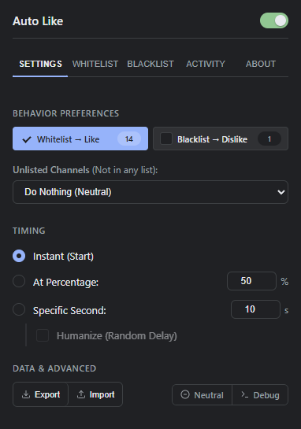
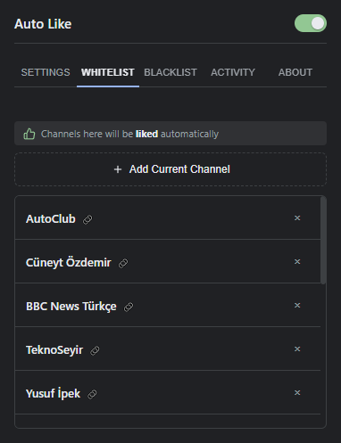
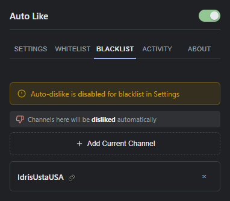
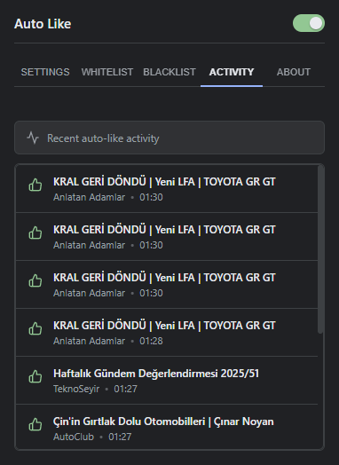
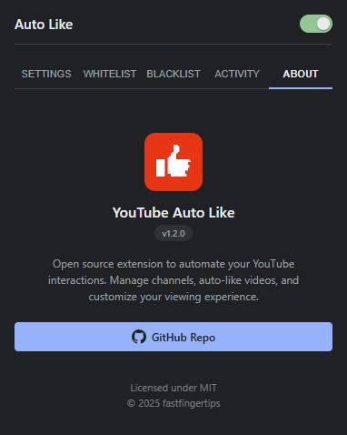

# YouTube Interaction Manager

<picture>
  <source media="(prefers-color-scheme: dark)" srcset="docs/store/promo_marquee_dark.png">
  <source media="(prefers-color-scheme: light)" srcset="docs/store/promo_marquee_light.png">
  
</picture>

Smart interaction manager for YouTube. Auto-like whitelist, auto-dislike blacklist, and detailed activity logging. Improve your viewing experience by automating interactions with your favorite channels.

## Download

- **[Chrome Web Store](https://chromewebstore.google.com/detail/youtube-auto-like/nlpclmfebmnahbhffafphgnajkbkiaib)**: Install directly for Chrome/Edge
- **[GitHub Releases](https://github.com/fastfingertips/youtube-auto-liker/releases)**: Download for Chrome or Firefox (Firefox Store coming soon)
- **[Website](https://fastfingertips.github.io/youtube-auto-liker/)**: Visit our documentation site

## Screenshots

| Settings | Whitelist | Blacklist |
|:--------:|:---------:|:---------:|
|  |  |  |

| Activity | About |
|:--------:|:-----:|
|  |  |

## How it Works

When you open a YouTube video, the extension checks if the channel is in your whitelist or blacklist. If it's in the whitelist, it clicks the like button for you. If it's in the blacklist, it clicks dislike. Simple as that.

You can also set when this happens - right away, after watching some percentage of the video, or after a specific number of seconds. The "Humanize" option adds a random delay so it looks more natural. All actions are performed locally on your browser.

## Installation

### Chrome / Edge
1. Download the `youtube-auto-like-vX.X.X-chrome.zip` from [Releases](https://github.com/fastfingertips/youtube-auto-liker/releases)
2. Extract the ZIP file
3. Open browser and navigate to `chrome://extensions/`
4. Enable **"Developer mode"** (top right)
5. Click **"Load unpacked"** and select the extracted `src` folder (or the root folder containing common files)

### Firefox
1. Download the `youtube-auto-like-vX.X.X-firefox.zip` from [Releases](https://github.com/fastfingertips/youtube-auto-liker/releases)
2. Open Firefox and navigate to `about:debugging#/runtime/this-firefox`
3. Click **"Load Temporary Add-on..."**
4. Select the `manifest.json` from the extracted folder

## Features

### Smart Actions
- **Whitelist**: Automatically LIKE videos from channels you trust
- **Blacklist**: Automatically DISLIKE videos from channels you don't enjoy
- **Unlisted Channels**: Flexible options for channels not in any list:
  - Do Nothing (Default)
  - Like Everything
  - Dislike Everything
  - **Neutral Badge**: Only show the list status icon without taking any action

### Flexible Timing
- **Instant**: Trigger the action immediately when the video starts
- **At Percentage**: Trigger after watching a specific percentage of the video
- **Specific Second**: Trigger after a specific number of seconds
- **Humanize**: Adds random delay to mimic natural human interaction (only with Specific Second)

### Activity & Management
- **Activity Log**: View a history of recent actions with channel info (last 50 items)
- **History Toggle**: Enable or disable activity logging entirely
- **Import/Export**: Backup your settings and channel lists to JSON
- **Cross-Browser**: Optimized for both Chrome and Firefox

## Usage

### Settings Tab
- Configure how Whitelisted, Blacklisted, and Unlisted channels are treated
- Set your preferred timing (Instant, Percent, or Time)
- Enable "Humanize" for random delays
- Use Export/Import to save your configuration

### Whitelist / Blacklist Tabs
- **Add Current Channel**: Click while watching a video to add the channel
- Manage your lists by removing channels
- Status banner shows when list action is disabled

### Activity Tab
- View recent auto-like/dislike activity
- Click on entries to open the video

## Permissions

This extension uses minimal permissions required for functionality:

| Permission | Why It's Needed |
|------------|-----------------|
| `storage` | Save your whitelist, blacklist, settings, and activity logs locally |
| `activeTab` | Detect and interact with the current YouTube channel from the popup |
| `youtube.com` | Run the content script to detect videos and click like/dislike buttons |

**No data is ever sent to external servers.** All information stays on your device.

## Privacy

This extension does not collect any personal data. All data is stored locally on your device. See our [Privacy Policy](https://fastfingertips.github.io/youtube-auto-liker/privacy.html) for details.

## License

MIT