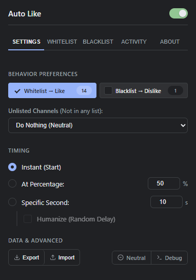
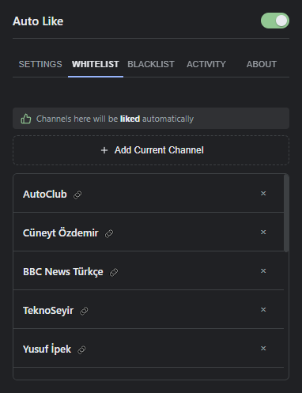
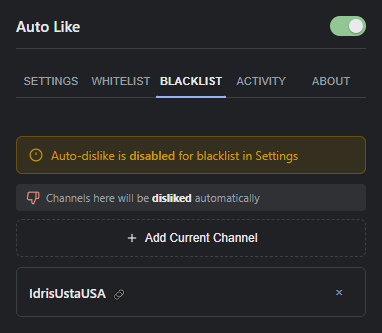
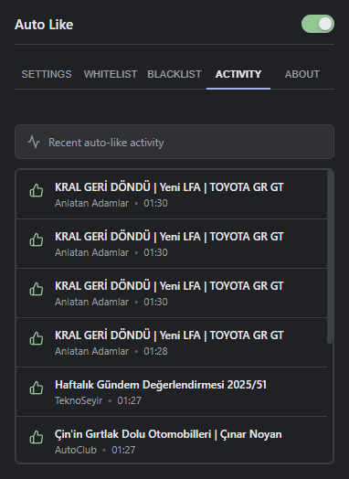
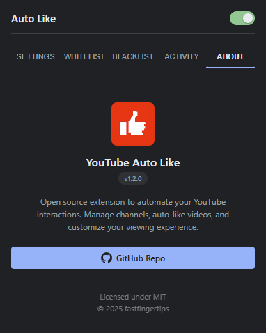

<h1 align="center">YouTube Interaction Manager</h1>

<picture>
  <source media="(prefers-color-scheme: dark)" srcset="docs/store/promo_marquee_dark.png">
  <source media="(prefers-color-scheme: light)" srcset="docs/store/promo_marquee_light.png">
  
</picture>

  
  
  

Smart interaction manager for YouTube. Auto-like whitelist, auto-dislike blacklist, and detailed activity logging. Improve your viewing experience by automating interactions with your favorite channels.

## Download

- **[Chrome Web Store](https://chromewebstore.google.com/detail/youtube-auto-like/nlpclmfebmnahbhffafphgnajkbkiaib)**: Install directly for Chrome/Edge
- **[GitHub Releases](https://github.com/fastfingertips/youtube-interaction-manager/releases)**: Download release packages
- **[Guide](https://ytmanager.bugra.co/guide.html)**: Read setup, usage, permissions, and privacy notes

## Screenshots

| Settings | Whitelist | Blacklist |
|:--------:|:---------:|:---------:|
|  |  |  |

| Activity | About |
|:--------:|:-----:|
|  |  |

## Documentation

Setup, usage, permissions, and privacy details live on the [website guide](https://ytmanager.bugra.co/guide.html).

## License

MIT
